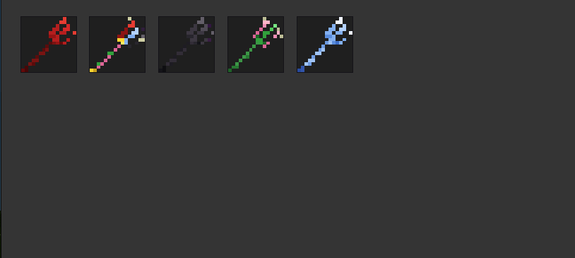

# Tridents

Five elemental tridents for Luanti, each with unique combat effects and passive abilities.

## Tridents

### Fire Trident
- Ignites targets on hit (1 damage/sec for 5 seconds)
- +2 damage buff when wielded
- **Immunity to fire/lava damage** while in inventory
- Dropped by **Inferno Titan** boss

### Lightning Trident
- Strikes lightning on hit with thunder and sky flash
- Sets the ground on fire at the strike point
- **Immunity to lightning damage** while in inventory
- Dropped by **Storm Colossus** boss

### Wither Trident
- Applies wither effect that deals **true damage** (bypasses armor)
- 2 damage every 0.5s for 4 seconds
- Fastest swing speed of all tridents
- Dropped by **Void Reaper** boss

### Support Trident
- Heals you equal to damage dealt on each hit
- Right-click for full heal (30 second cooldown)
- Dropped by **Life Warden** boss

### Master Trident
- All powers combined: fire, lightning, wither, and lifesteal
- Right-click full heal with 30 second cooldown
- Fire and lightning immunity while in inventory
- Highest damage and durability
- Craft: all 4 tridents + diamond + mese block (requires `default` mod)

## Stats

| Trident | Damage | Speed | Durability | Light |
|---------|--------|-------|------------|-------|
| Fire | 10 | 0.9s | 250 | 5 |
| Lightning | 10 | 1.1s | 200 | 7 |
| Wither | 9 | 0.8s | 220 | 2 |
| Support | 6 | 1.0s | 300 | 4 |
| Master | 12 | 0.8s | 500 | 10 |

## How to obtain

Fire, Lightning, Wither, and Support tridents are **boss drops only** — defeat bosses from the Infectious mod to earn them. The Master Trident is crafted by combining all four tridents with a diamond and mese block.

## Dependencies

All dependencies are optional. The mod works standalone on any game.

- `default` — enables the Master Trident crafting recipe
- `lightning` — uses real lightning strikes; without it, a visual/sound fallback is used

## License

- Code: MIT
- Textures: CC BY-SA 4.0
